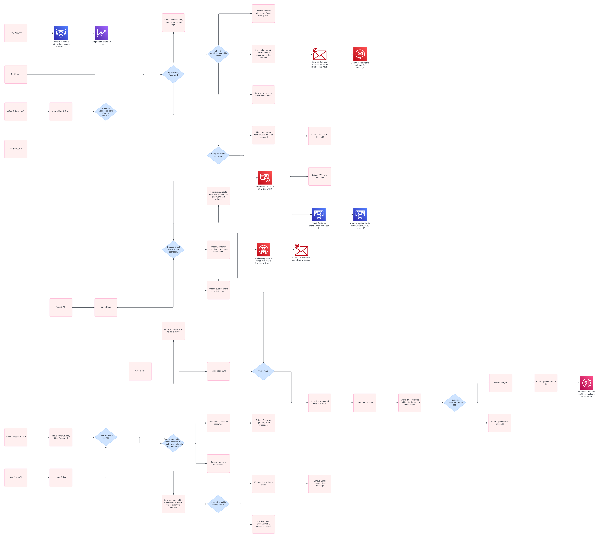

# Scoreboard API Module

This module is designed to manage and update a live scoreboard for a website, ensuring secure and real-time updates of users' scores.

## Features

- Display top 10 user scores.
- Real-time score updates using Socket.io.
- Secure score updates to prevent unauthorized modifications.

## API Endpoints

### Register API (`/api/register`)

- **Description**: Registers a new user with an email and password. If the email is already in use and activated, it returns an error. If the email exists but is not activated, a confirmation email is resent. Otherwise, it creates a new user, sends a confirmation email, and returns a success message.
- **Request**:
  - `POST /api/register`
  - Body: `{ "email": "user@example.com", "password": "securepassword" }`
- **Response**:
  - `200 OK`: A confirmation email is sent.
  - `400 Bad Request`: Email already exists and is activated.
  - `400 Bad Request`: Email exists but is not activated, confirmation email resent.

### Confirm API (`/api/confirm`)

- **Description**: Confirms the user's email address using a token sent during registration. If the token is valid and not expired, the user's account is activated.
- **Request**:
  - `GET /api/confirm?token=yourtoken`
- **Response**:
  - `200 OK`: Email successfully activated.
  - `400 Bad Request`: Token is expired or email is already activated.

### Login API (`/api/login`)

- **Description**: Authenticates a user with their email and password. On successful authentication, a JWT token is returned for managing the session.
- **Request**:
  - `POST /api/login`
  - Body: `{ "email": "user@example.com", "password": "securepassword" }`
- **Response**:
  - `200 OK`: JWT token returned.
  - `401 Unauthorized`: Email or password is incorrect.

### OAuth2 Login API (`/api/oauth2/login`)

- **Description**: Authenticates a user using an OAuth2 access token. If authentication is successful, a JWT token is returned.
- **Request**:
  - `POST /api/oauth2/login`
  - Body: `{ "accessToken": "oauth2token" }`
- **Response**:
  - `200 OK`: JWT token returned.
  - `400 Bad Request`: Email cannot be retrieved or other errors occur.

### Forgot API (`/api/forgot`)

- **Description**: Initiates the password reset process by sending a reset email if the provided email exists in the system.
- **Request**:
  - `POST /api/forgot`
  - Body: `{ "email": "user@example.com" }`
- **Response**:
  - `200 OK`: Reset email sent.
  - `400 Bad Request`: Email does not exist.

### Reset Password API (`/api/reset`)

- **Description**: Resets the user's password using a reset token. If the token is valid and not expired, the password is updated.
- **Request**:
  - `POST /api/reset`
  - Body: `{ "token": "resetToken", "email": "user@example.com", "newPassword": "newsecurepassword" }`
- **Response**:
  - `200 OK`: Password successfully reset.
  - `400 Bad Request`: Token is expired or invalid.

### Get Top API (`/api/top`)

- **Description**: Retrieves the top 10 users with the highest scores from the system.
- **Request**:
  - `GET /api/top`
- **Response**:
  - `200 OK`: Returns a list of the top 10 users and their scores.

### Action API (`/api/action`)

- **Description**: Increases the user's score upon completion of an action. Validates the JWT, updates the user's score, and refreshes the top scores list if necessary.
- **Request**:
  - `POST /api/action`
  - Headers: `Authorization: Bearer <jwt_token>`
  - Body: `{ "actionData": "some_data" }`
- **Response**:
  - `200 OK`: Score updated and top 10 list refreshed.
  - `401 Unauthorized`: JWT is invalid or not found in Redis.

### Notification API (`/api/notification`)

- **Description**: Sends real-time updates to users using Socket.io. Requires an active WebSocket connection to receive notifications.
- **Request**:
  - **WebSocket** connection required.
- **Response**:
  - **WebSocket Event**: `Notification` with updated data.

## How the API Works

1. **User Registration & Confirmation**:
   - Users register by providing an email and password. A confirmation email with a token is sent. The email is confirmed using the token, activating the user account.

2. **User Login & OAuth2 Login**:
   - Users log in with their email and password or via OAuth2. Successful authentication returns a JWT token for managing user sessions.

3. **Password Management**:
   - Users can request a password reset, which sends a reset email with a token. The password is reset using the token.

4. **Score Management**:
   - Actions performed by users are processed to update scores. The top 10 scores are managed and updated accordingly. The `Get Top` API retrieves these scores.

5. **Notifications**:
   - Real-time score updates and other notifications are sent to clients via Socket.io WebSocket connections.

## Database Design

### User Table

- **Table Name**: `users`
- **Fields**:
  - `id` (Primary Key, Auto Increment)
  - `email` (Unique, VARCHAR)
  - `password` (VARCHAR)
  - `activated` (BOOLEAN, Default: FALSE)
  - `created_at` (TIMESTAMP)
  - `updated_at` (TIMESTAMP)

### Email Confirmation Table

- **Table Name**: `email_confirmations`
- **Fields**:
  - `id` (Primary Key, Auto Increment)
  - `user_id` (Foreign Key to `users.id`)
  - `token` (VARCHAR)
  - `expires_at` (TIMESTAMP)
  - `created_at` (TIMESTAMP)

### Password Reset Table

- **Table Name**: `password_resets`
- **Fields**:
  - `id` (Primary Key, Auto Increment)
  - `user_id` (Foreign Key to `users.id`)
  - `token` (VARCHAR)
  - `expires_at` (TIMESTAMP)
  - `created_at` (TIMESTAMP)

### Scores Table

- **Table Name**: `scores`
- **Fields**:
  - `id` (Primary Key, Auto Increment)
  - `user_id` (Foreign Key to `users.id`)
  - `score` (INTEGER)
  - `updated_at` (TIMESTAMP)

### Redis Cache Design

- **Key for Top Scores**: `top_scores`
  - **Type**: Sorted Set
  - **Score**: User score
  - **Member**: User ID

## Diagram

Below is a diagram illustrating the flow of execution for the APIs:

## Comments for Improvement

1. **Security Enhancements**
   - Rate Limiting: Implement rate limiting using tools like \`express-rate-limit\` in Node.js to prevent abuse.
   - HTTPS: Configure HTTPS using SSL/TLS certificates to secure communication.
   - Input Validation: Use validation libraries like \`joi\` or \`validator\` to ensure input data is clean and secure.

2. **Scalability**
   - Distributed Database: Consider using databases like Cassandra or MongoDB for better scalability.
   - Message Queues: Implement RabbitMQ or Kafka for handling asynchronous tasks and high traffic.

3. **Monitoring and Logging**
   - Logging: Use \`winston\` or \`morgan\` for logging in Node.js applications.
   - Monitoring: Integrate Prometheus for monitoring metrics and Grafana for visualizing them.

4. **Testing**
   - Unit Testing: Use testing frameworks like \`jest\` or \`mocha\` for unit tests.
   - Integration Testing: Use tools like \`supertest\` for testing API endpoints.
   - Load Testing: Use tools like \`k6\` or Apache JMeter to simulate high traffic and test system performance.
   - Security Testing: Use tools like OWASP ZAP or Burp Suite for security testing.

5. **Documentation**
   - API Documentation: Use Swagger to auto-generate API documentation.
   - Setup Instructions: Provide clear and detailed setup instructions, including environment setup and dependency installation.
   - Usage Examples: Include common usage examples and scenarios in the documentation to help developers get started quickly.
6. **Separation of Notification API**:
   - Separate the Notification API into its own dedicated broker and adopt a microservices architecture. This approach will improve connection management and stability for Socket.io by using sticky sessions.

---

This specification is provided for the backend engineering team to implement the required functionality for the Scoreboard API Module. For any clarifications or further details, please refer to the comments section or contact the project manager.
